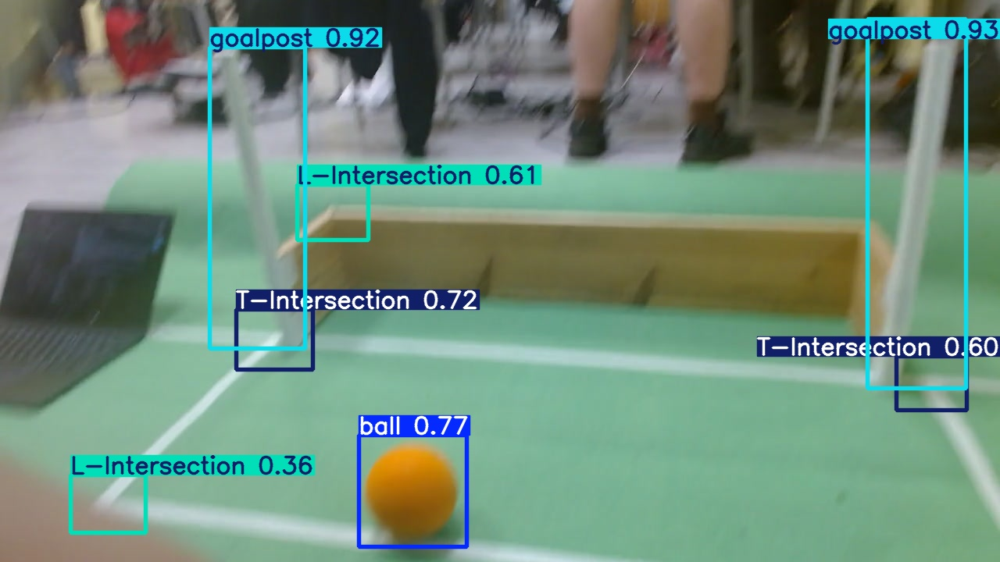

# extra_nodes

Дополнительные ROS 2 (Jazzy) ноды поверх стека OP3.

## football_vision — распознавание объектов поля

Нода компьютерного зрения: берёт кадр с камеры, прогоняет через обученную
YOLO-сеть (8 классов) и публикует в один топик координаты всего, что видит —
мяч, штанги, роботов, препятствия, перекладину, пересечения линий.

Заменяет по смыслу старый `op3_ball_detector` (OpenCV, только красный мяч):
здесь нейросеть, которая работает и по оранжевому мячу.

Два пакета:
- `football_vision_msgs` — сообщения (`Detection`, `FieldObjects`);
- `football_vision` — сама нода + launch + конфиг + веса.

---

### Что публикуется

Топик **`/vision/field_objects`** (`football_vision_msgs/FieldObjects`) — один
раз на кадр. Внутри — по массиву на каждый класс, любой может быть пустым:

```
std_msgs/Header header
uint32 image_width
uint32 image_height
Detection[] balls
Detection[] goalposts
Detection[] robots
Detection[] obstacles
Detection[] crossbars
Detection[] l_intersections
Detection[] t_intersections
Detection[] x_intersections
```

Один объект (`Detection`):

```
float32 x            # центр X, [-1..1]: -1 левый край, +1 правый, 0 центр
float32 y            # центр Y, [-1..1]: -1 низ,        +1 верх,   0 центр
float32 confidence   # уверенность [0..1]
float32 width        # ширина рамки, доля кадра [0..1]
float32 height       # высота рамки, доля кадра [0..1]
```

Плюс отладочный топик **`/vision/image_annotated`** (`sensor_msgs/Image`) —
кадр с нарисованными рамками (можно смотреть в rqt/web_video_server).

### Система координат

Центр объекта — две координаты в диапазоне **[-1, 1]**:

- **x**: `-1` левый край кадра, `+1` правый, `0` центр по горизонтали.
- **y**: `-1` низ кадра, `+1` верх, `0` центр по вертикали. **Ось Y смотрит вверх.**

Пересчёт из пикселей (центр рамки cx, cy; размер кадра W×H):

```
x = cx / W * 2 - 1
y = -(cy / H * 2 - 1)
```

#### Пример на кадре из датасета



Кадр **1280×720**. Что распознала сеть и какие вышли координаты:

| объект    | центр (пиксели) | x | y | где это на кадре |
|-----------|-----------------|-------|-------|------------------|
| ball      | 528, 629 | **-0.174** | **-0.748** | у нижнего края, чуть левее центра |
| goalpost (правая) | 1173, 261 | **+0.833** | **+0.274** | справа, в верхней половине |
| goalpost (левая)  | 330, 253 | **-0.485** | **+0.297** | слева, в верхней половине |
| T-Intersection | 1192, 491 | +0.863 | -0.364 | правый край, ниже центра |
| L-Intersection | 426, 272 | -0.334 | +0.245 | левее центра, выше середины |

Мяч лежит внизу по центру → `y ≈ -0.75` (низ = отрицательный), `x ≈ -0.17`
(почти по центру). Правая штанга у самого края справа → `x ≈ +0.83`. Верх кадра
даёт `y > 0`, поэтому у штанг (они выше горизонта) `y` положительный.

---

### Зависимости

Всё ставится один раз на роботе. Нужны три группы.

**1. ROS 2 (Jazzy) пакеты** — обычно уже есть в стеке OP3; доставить недостающее:

```bash
sudo apt install -y \
  ros-jazzy-rclpy \
  ros-jazzy-sensor-msgs \
  ros-jazzy-std-msgs \
  ros-jazzy-cv-bridge \
  ros-jazzy-usb-cam \
  ros-jazzy-image-transport-plugins   # нужен только при use_compressed:=true
```

`football_vision_msgs` (сообщения `Detection`/`FieldObjects`) собирается из этого
же репозитория — отдельно ставить не надо.

**2. Python-библиотеки для инференса** (через pip, не через rosdep).

⚠️ **Важно про порядок и про два подводных камня** (наступали на оба —
ставь строго в этом порядке, одной пачкой, и не ставь пакеты по одному
позже — каждая последующая команда `pip install X` может тихо переустановить
`numpy`/`opencv-python` и снова всё сломать):

```bash
sudo apt install -y python3-pip

# 1) torch — СРАЗУ CPU-сборкой, НЕ дефолтной (дефолт = CUDA, ~2.5 ГБ и
#    десяток ненужных nvidia-*/cuda-*/triton пакетов; GPU у робота нет)
python3 -m pip install --user --break-system-packages \
  torch torchvision --index-url https://download.pytorch.org/whl/cpu

# 2) ultralytics и (опционально) openvino — одной командой
python3 -m pip install --user --break-system-packages ultralytics openvino

# 3) numpy — ПОСЛЕДНИМ шагом, жёстко <2
python3 -m pip install --user --break-system-packages "numpy<2"

# 4) opencv-python пришёл как зависимость ultralytics и требует numpy>=2 —
#    убрать его, использовать системный cv2 (нужен для cv_bridge)
python3 -m pip uninstall -y --break-system-packages opencv-python
```

**Почему именно так:**
- `ultralytics` тянет `opencv-python` (pip-пакет `opencv-python>=5.0` требует
  `numpy>=2`), но нода использует **системный** OpenCV 4.6 (`apt python3-opencv`)
  через `cv_bridge` — если pip-шный `opencv-python` останется в
  `~/.local/.../site-packages`, он **перекроет** системный в `sys.path`, и
  `cv_bridge.cv2_to_imgmsg` упадёт с `KeyError`. Поэтому его всегда удаляем
  после установки `ultralytics`.
- Системный `scipy` (нужен другим инструментам) требует `numpy<1.28`, поэтому
  `numpy` пинуем к `<2` (проверено: `1.26.4`) **последней командой** — если
  запустить что-то после (`pip install openvino` и т.п.) без этого пина, numpy
  снова уедет на 2.x и всё сломается по новой.
- Если позже понадобится доставить ещё один pip-пакет — после этого **всегда**
  перепроверяй:
  ```bash
  python3 -c "import numpy, cv2; print(numpy.__version__, cv2.__version__, cv2.__file__)"
  ```
  Ожидается `numpy < 2` и путь `cv2` из `/usr/lib/python3/dist-packages/...`
  (НЕ из `~/.local/...`). Если не так — повтори шаги 3-4 выше.

Экспорт весов в OpenVINO (`best.pt` → `best_openvino_model/`) и `model_path`
на эту папку — `ultralytics` подхватит её тем же API, дополнительно ничего
ставить не нужно, если `openvino` уже стоит из шага 2.

Сводка версий, на которых проверялось: ROS 2 Jazzy, Python 3.12,
ultralytics 8.4.x, torch 2.13 (`+cpu`), numpy 1.26.4, openvino 2026.2.1,
cv_bridge (jazzy), usb_cam (jazzy).

### Запуск

Всё выполняется на роботе (OP3). ROS-окружение подхватывается из `~/.bashrc`.

**1. Сборка** (один раз после появления файлов):

```bash
cd ~/robotis_ws_git
colcon build --packages-select football_vision_msgs football_vision
source install/setup.bash
```

**2. Запуск камеры + ноды:**

```bash
ros2 launch football_vision vision.launch.py
```

Если камеру уже поднял другой launch (op3_bringup / strategy) — только нода:

```bash
ros2 launch football_vision vision.launch.py with_camera:=false
```

**3. Проверить, что идёт распознавание:**

```bash
ros2 topic echo /vision/field_objects        # координаты объектов
ros2 topic hz /vision/field_objects          # частота
```

Отладочную картинку с рамками смотреть через `web_video_server`
(`/vision/image_annotated`) или `ros2 run rqt_image_view rqt_image_view`.

### Настройка

Параметры — в [`football_vision/config/vision.yaml`](football_vision/config/vision.yaml):

- `imgsz` — `736` точнее, `480` (по умолч.) баланс, `320` быстрее.
- `conf` — порог уверенности.
- `model_path` — путь к весам; пусто → `models/best.pt`. Для скорости на Intel
  укажи папку OpenVINO-экспорта (`best_openvino_model`).
- `image_topic` / `use_compressed` — источник кадров.

### Как это работает (кратко)

1. Подписка на топик картинки камеры (`sensor_msgs/Image`, QoS sensor_data).
2. Каждый кадр → `ultralytics.YOLO.predict` (пока считается один кадр, новые
   отбрасываются — очередь не растёт).
3. Каждая рамка → перевод центра в координаты `[-1,1]` → раскладывается в
   массив своего класса в `FieldObjects`.
4. Публикация `/vision/field_objects` (+ опционально картинки с рамками).

Контекст для ИИ-агентов и полное описание интерфейсов — в
[`football_vision/AGENTS.md`](football_vision/AGENTS.md).
